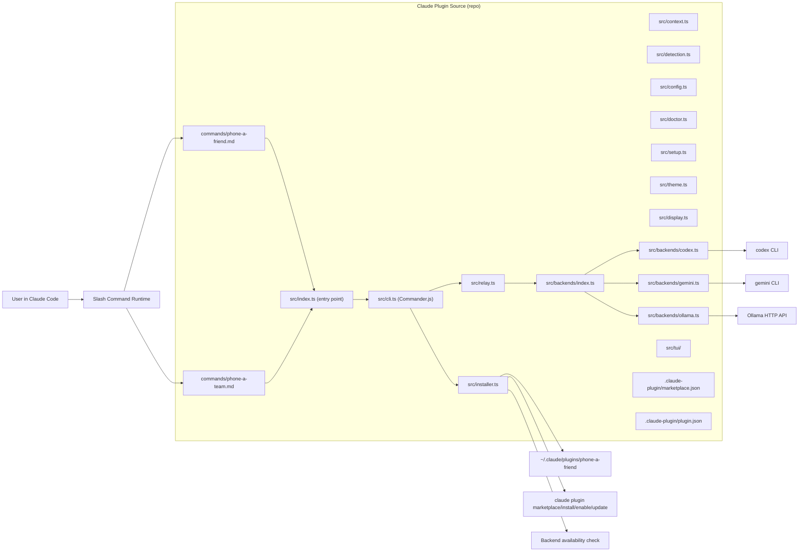
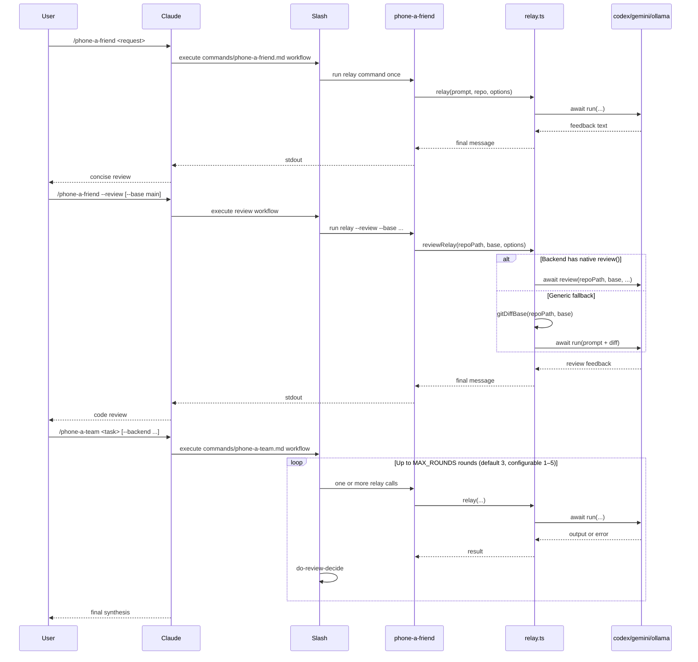

# System Overview

`phone-a-friend` is a TypeScript CLI relay and Claude Code plugin that routes task prompts plus repository context to external coding backends (`codex`, `gemini`, or `ollama`). The `/phone-a-friend` command provides one-shot relay, `--review` provides diff-scoped code review, and `/phone-a-team` adds iterative, multi-round refinement on top of the relay.

## High-Level Architecture

## One-Shot, Review, and Iterative Entry Points

## Key Components and Responsibilities

| Component | File | Role |
|-----------|------|------|
| One-shot slash command | `commands/phone-a-friend.md` | Prompt policy for one-shot relay (with optional review mode) |
| Iterative slash command | `commands/phone-a-team.md` | Prompt policy for multi-round refinement loop |
| Entry point | `src/index.ts` | Imports backends (self-register), runs CLI |
| CLI parser | `src/cli.ts` | Commander.js with subcommands: relay, setup, doctor, config, plugin |
| Relay core | `src/relay.ts` | Backend-agnostic orchestration: `relay()` + `reviewRelay()`, prompt assembly, limits, depth guard |
| Relay context types | `src/context.ts` | `RelayContext` interface definition |
| Backend registry | `src/backends/index.ts` | Backend interface, registry, types (`BackendResult`, `ReviewOptions`), error hierarchy |
| Codex adapter | `src/backends/codex.ts` | Subprocess adapter for `codex exec` with native `review()` |
| Gemini adapter | `src/backends/gemini.ts` | Subprocess adapter for `gemini --prompt` |
| Ollama adapter | `src/backends/ollama.ts` | HTTP adapter for Ollama API (`fetch`) |
| Backend detection | `src/detection.ts` | CLI, Local (Ollama), and Host (Claude) backend detection with environment status |
| Config | `src/config.ts` | TOML configuration system with layered resolution |
| Doctor | `src/doctor.ts` | Health check command — human-readable and JSON output |
| Setup wizard | `src/setup.ts` | Interactive setup for first-time configuration |
| Theme | `src/theme.ts` | Shared terminal styling (colors, symbols, banner) |
| Display | `src/display.ts` | Formatted output helpers |
| Installer | `src/installer.ts` | Install/update/uninstall plugin, marketplace sync |
| TUI | `src/tui/` | Interactive Ink (React) dashboard with 4 tabs |
| Plugin identity | `.claude-plugin/plugin.json` | Plugin name, version, author |
| Marketplace source | `.claude-plugin/marketplace.json` | Marketplace name and source mapping |

## Data Flow

1. User invokes slash command in Claude Code.
2. Slash command prompt file determines run policy (`/phone-a-friend` one-shot, `/phone-a-team` iterative).
3. Command executes `phone-a-friend relay --prompt ...` (with optional `--review` and `--base` flags for review mode).
4. CLI parses args and calls relay, review relay, or installer path.
5. For standard relay: composes full backend prompt from request, optional context, optional git diff, and repo metadata.
6. For review relay: resolves base branch (auto-detects `main`/`master`/`HEAD~1`), tries native `backend.review()` if available, falls back to generic diff relay via `backend.run()`.
7. Relay selects backend adapter and executes: subprocess for CLI backends (codex, gemini) or HTTP fetch for Ollama.
8. All backends return `Promise<string>` — relay awaits the result.
9. Backend output is returned to Claude session for synthesis.
10. Installer commands optionally sync plugin registration with `claude plugin` subcommands and report backend availability.

## Important Design Decisions and Constraints

- One-shot relay engine is code-enforced; `/phone-a-team` behavior is prompt-enforced policy (no runtime loop enforcement).
- Default sandbox is `read-only`; broader modes are opt-in.
- Relay guards recursion with `PHONE_A_FRIEND_DEPTH`.
- Prompt/context/diff limits are hard byte caps to prevent oversized relays.
- Plugin version must remain synchronized between `package.json` and `.claude-plugin/plugin.json` (CI/release checks).
- Installer supports both symlink and copy to balance dev velocity vs isolated installs.
- All backend `run()` methods return `Promise<string>`, enabling both subprocess and HTTP backends.
- Built bundle in `dist/` is committed for self-contained symlink installs.
- Review relay uses dual-path strategy: native `backend.review()` (Codex only) with generic diff fallback for other backends.
