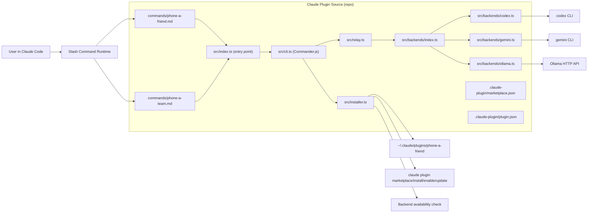
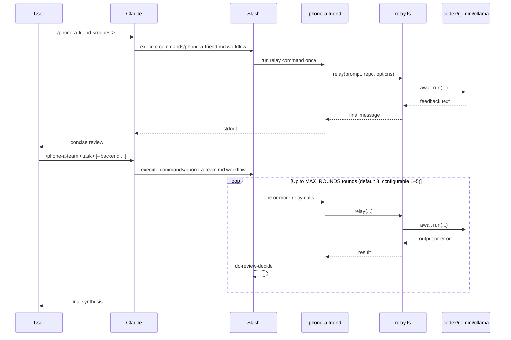

# System Overview

`phone-a-friend` is a TypeScript CLI relay and Claude Code plugin that routes task prompts plus repository context to external coding backends (`codex`, `gemini`, or `ollama`). In `v0.2.0`, `/phone-a-team` adds iterative, multi-round refinement on top of the existing one-shot `/phone-a-friend` relay.

## High-Level Architecture

## One-Shot vs Iterative Entry Points

## Key Components and Responsibilities

| Component | File | Role |
|-----------|------|------|
| One-shot slash command | `commands/phone-a-friend.md` | Prompt policy for single-relay review |
| Iterative slash command | `commands/phone-a-team.md` | Prompt policy for multi-round refinement loop |
| Entry point | `src/index.ts` | Imports backends (self-register), runs CLI |
| CLI parser | `src/cli.ts` | Commander.js with subcommands: relay, setup, doctor, config, plugin |
| Relay core | `src/relay.ts` | Backend-agnostic orchestration, prompt assembly, limits, depth guard |
| Backend registry | `src/backends/index.ts` | Backend interface, registry, types, error hierarchy |
| Codex adapter | `src/backends/codex.ts` | Subprocess adapter for `codex exec` |
| Gemini adapter | `src/backends/gemini.ts` | Subprocess adapter for `gemini --prompt` |
| Ollama adapter | `src/backends/ollama.ts` | HTTP adapter for Ollama API (`fetch`) |
| Installer | `src/installer.ts` | Install/update/uninstall plugin, marketplace sync |
| Config | `src/config.ts` | TOML configuration system with layered resolution |
| TUI | `src/tui/` | Interactive Ink (React) dashboard with 4 tabs |
| Plugin identity | `.claude-plugin/plugin.json` | Plugin name, version, author |
| Marketplace source | `.claude-plugin/marketplace.json` | Marketplace name and source mapping |

## Data Flow

1. User invokes slash command in Claude Code.
2. Slash command prompt file determines run policy (`/phone-a-friend` one-shot, `/phone-a-team` iterative).
3. Command executes `phone-a-friend relay --prompt ...`.
4. CLI parses args and calls relay or installer path.
5. Relay composes full backend prompt from request, optional context, optional git diff, and repo metadata.
6. Relay selects backend adapter and executes: subprocess for CLI backends (codex, gemini) or HTTP fetch for Ollama.
7. All backends return `Promise<string>` — relay awaits the result.
8. Backend output is returned to Claude session for synthesis.
9. Installer commands optionally sync plugin registration with `claude plugin` subcommands and report backend availability.

## Important Design Decisions and Constraints

- One-shot relay engine is code-enforced; `/phone-a-team` behavior is prompt-enforced policy (no runtime loop enforcement).
- Default sandbox is `read-only`; broader modes are opt-in.
- Relay guards recursion with `PHONE_A_FRIEND_DEPTH`.
- Prompt/context/diff limits are hard byte caps to prevent oversized relays.
- Plugin version must remain synchronized between `package.json` and `.claude-plugin/plugin.json` (CI/release checks).
- Installer supports both symlink and copy to balance dev velocity vs isolated installs.
- All backend `run()` methods return `Promise<string>`, enabling both subprocess and HTTP backends.
- Built bundle in `dist/` is committed for self-contained symlink installs.
