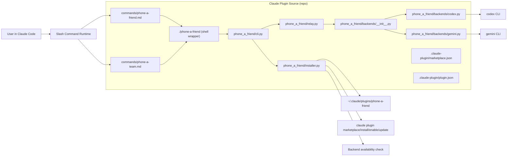
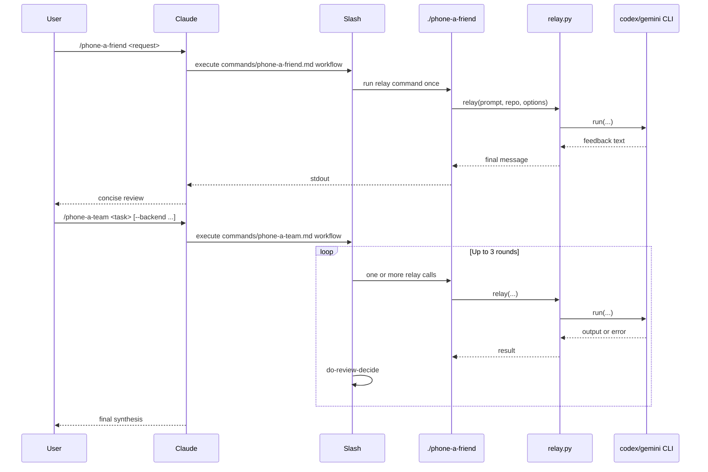

# System Overview

`phone-a-friend` is a Python CLI relay and Claude Code plugin that routes task prompts plus repository context to external coding backends (`codex` or `gemini`). In `v0.2.0`, `/phone-a-team` adds iterative, multi-round refinement on top of the existing one-shot `/phone-a-friend` relay.

## High-Level Architecture

## One-Shot vs Iterative Entry Points

## Key Components and Responsibilities

| Component | File | Role |
|-----------|------|------|
| One-shot slash command | `commands/phone-a-friend.md` | Prompt policy for single-relay review |
| Iterative slash command | `commands/phone-a-team.md` | Prompt policy for multi-round refinement loop |
| Shell wrapper | `phone-a-friend` | Resolves Python 3 and executes `python -m phone_a_friend.cli` |
| CLI parser | `phone_a_friend/cli.py` | Command parsing, dispatch to relay/installer, backend status |
| Relay core | `phone_a_friend/relay.py` | Backend-agnostic orchestration, prompt assembly, limits, depth guard |
| Backend adapters | `phone_a_friend/backends/*` | Concrete adapters for Codex and Gemini CLIs |
| Installer | `phone_a_friend/installer.py` | Install/update/uninstall plugin, marketplace sync |
| Plugin identity | `.claude-plugin/plugin.json` | Plugin name, version, author |
| Marketplace source | `.claude-plugin/marketplace.json` | Marketplace name and source mapping |

## Data Flow

1. User invokes slash command in Claude Code.
2. Slash command prompt file determines run policy (`/phone-a-friend` one-shot, `/phone-a-team` iterative).
3. Command executes `./phone-a-friend ...`.
4. CLI parses args and calls relay or installer path.
5. Relay composes full backend prompt from request, optional context, optional git diff, and repo metadata.
6. Relay selects backend adapter and executes backend CLI subprocess.
7. Backend output is returned to Claude session for synthesis.
8. Installer commands optionally sync plugin registration with `claude plugin` subcommands and report backend availability.

## Important Design Decisions and Constraints

- One-shot relay engine is code-enforced; `/phone-a-team` behavior is prompt-enforced policy (no runtime loop enforcement).
- Default sandbox is `read-only`; broader modes are opt-in.
- Relay guards recursion with `PHONE_A_FRIEND_DEPTH`.
- Prompt/context/diff limits are hard byte caps to prevent oversized relays.
- Plugin version must remain synchronized between `pyproject.toml` and `.claude-plugin/plugin.json` (CI/release checks).
- Installer supports both symlink and copy to balance dev velocity vs isolated installs.
