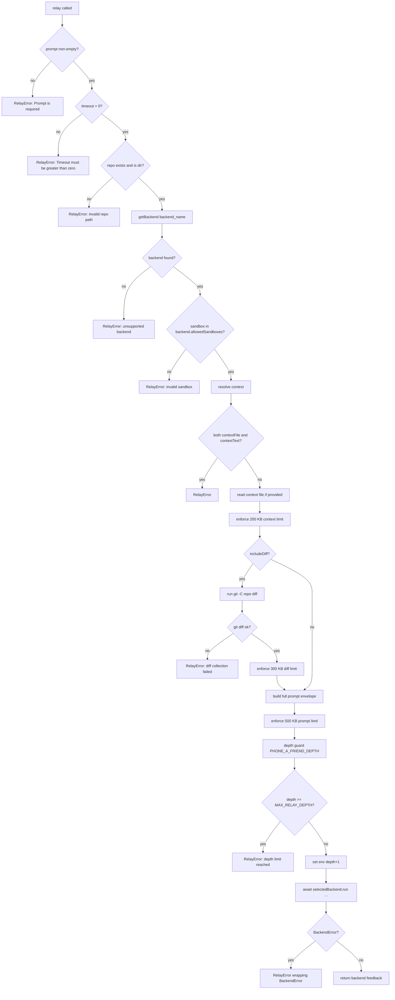
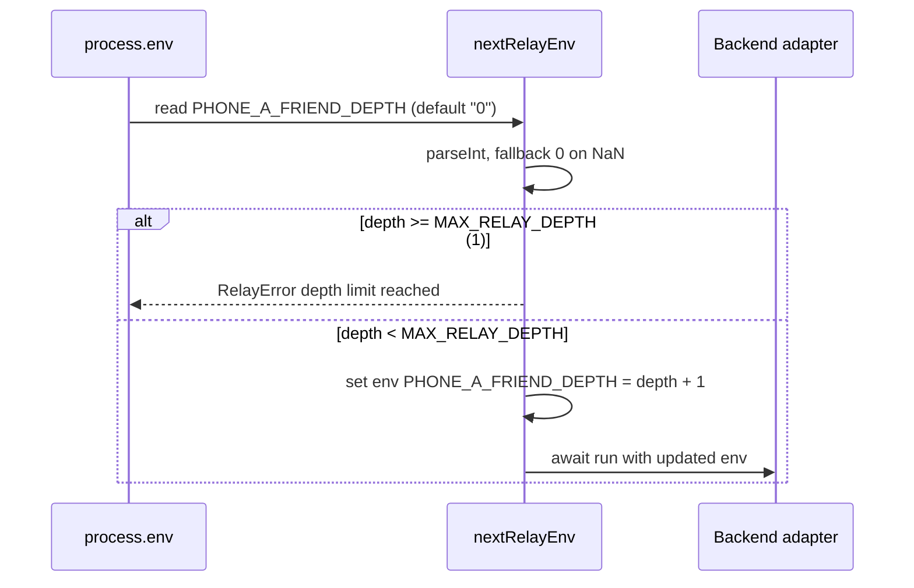
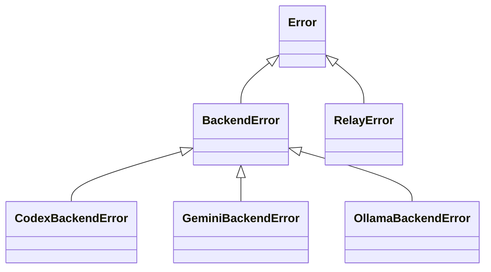

# Relay Core

`src/relay.ts` is the backend-agnostic execution core. It validates relay inputs, resolves context, optionally captures `git diff`, builds a normalized prompt envelope, enforces size limits, applies depth guard protection, and delegates execution to a selected backend adapter.

## Relay Processing Flow



## Prompt Envelope Structure

`buildPrompt(...)` constructs a consistent structure sent to every backend:

```
You are helping another coding agent by reviewing or advising on work in a local repository.
Repository path: /path/to/repo
Use the repository files for context when needed.
Respond with concise, actionable feedback.

Request:
<user prompt>

Additional Context:        (optional, if contextText provided)
<context text>

Git Diff:                  (optional, if includeDiff=true)
<diff output>
```

This normalization keeps backend prompts consistent across Codex, Gemini, and Ollama.

## Size Limit Enforcement

| Limit | Constant | Value |
|-------|----------|-------|
| Context | `MAX_CONTEXT_FILE_BYTES` | 200,000 bytes |
| Diff | `MAX_DIFF_BYTES` | 300,000 bytes |
| Final prompt | `MAX_PROMPT_BYTES` | 500,000 bytes |

Measurement uses `Buffer.byteLength(text, 'utf-8')`.

## Depth Guard Mechanism



- `MAX_RELAY_DEPTH = 1` means no nested relay inside an active relay execution.
- Invalid env value is tolerated by coercing to `0`.

## Key Components and Responsibilities

| Function | Role |
|----------|------|
| `resolveContextText` | Enforces mutual exclusivity of file/text context, delegates file reads |
| `readContextFile` | File existence/type/readability checks and context-size enforcement |
| `gitDiff` | Executes `git diff` via `execFileSync` and validates return |
| `buildPrompt` | Deterministic prompt assembly into envelope structure |
| `nextRelayEnv` | Recursion guard via env depth tracking |
| `relay` | Async orchestration entry point: validation, dispatch, unified error surface |

## Error Handling Chain



- Relay catches only `BackendError` from adapters and rethrows as `RelayError`.
- Validation and git/context/prompt/depth failures raise `RelayError` directly.
- Result: CLI sees one relay-level error type for user-facing failures.

## Important Design Decisions

- Fail-fast validation prevents unnecessary backend execution.
- Limits are enforced before backend invocation to bound payload size.
- Relay does not mutate repository content directly; side effects are delegated to backend CLIs under selected sandbox.
- Backend-specific behavior is isolated behind the `Backend` interface to keep relay logic backend-agnostic.
- All backend `run()` calls are awaited (`async/await`) — the interface is `Promise<string>`.
