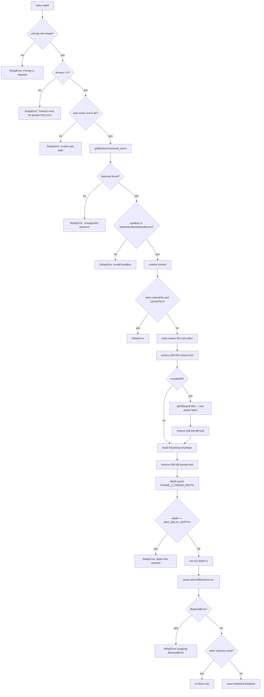
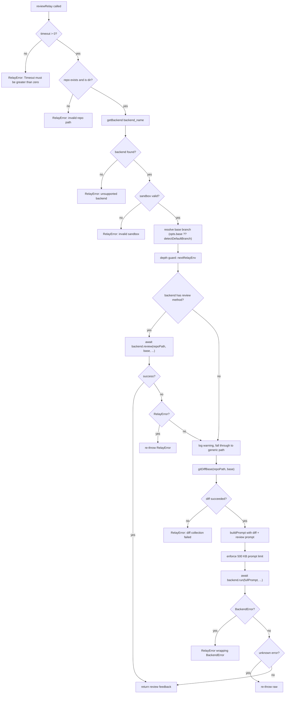
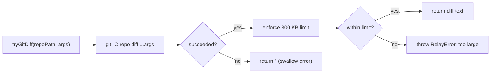
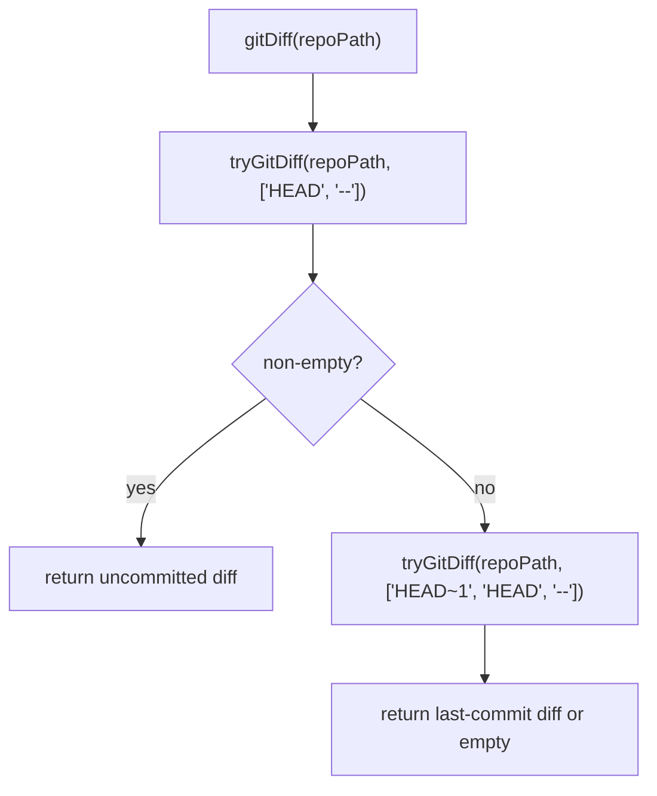
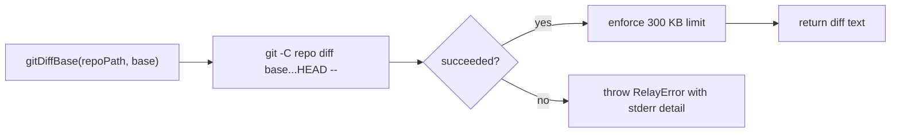
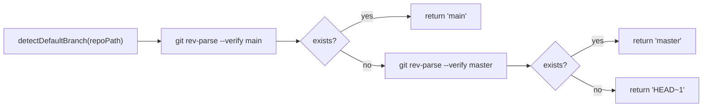
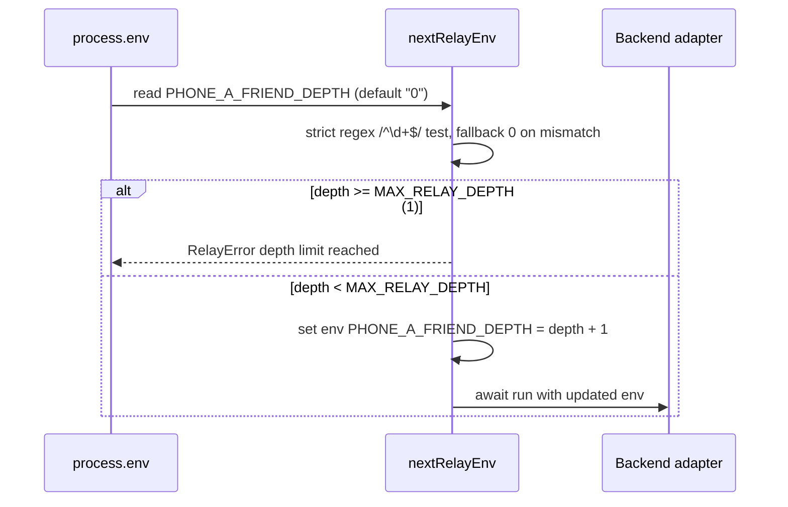
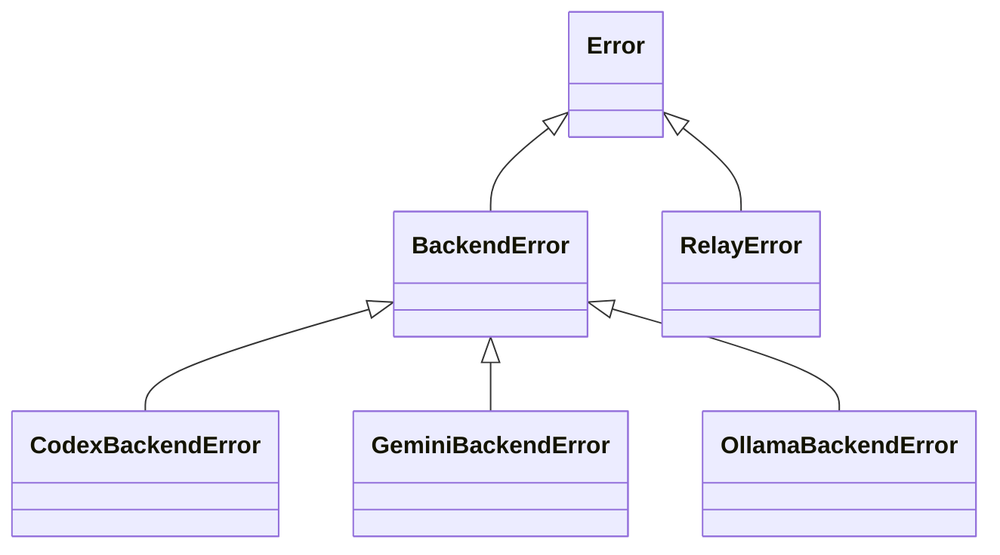

# Relay Core

`src/relay.ts` is the backend-agnostic execution core. It validates relay inputs, resolves context, optionally captures `git diff`, builds a normalized prompt envelope, enforces size limits, applies depth guard protection, and delegates execution to a selected backend adapter. It also provides a dedicated `reviewRelay()` path for diff-scoped code review.

## Relay Processing Flow



Note: git diff failures in `relay()` are silently swallowed by `tryGitDiff()` (returns `''`). Only size-limit violations from the diff are propagated as `RelayError`.

## Review Relay Flow

`reviewRelay()` provides diff-scoped code review. It supports a dual-path strategy: backends that implement a native `review()` method (currently only Codex) use it directly; all other backends fall back to a generic diff-based relay via `run()`.



### ReviewRelayOptions Interface

```typescript
interface ReviewRelayOptions {
  repoPath: string;
  backend?: string;       // default: 'codex'
  base?: string;          // default: detectDefaultBranch() → main/master/HEAD~1
  prompt?: string;        // default: 'Review the following changes.'
  timeoutSeconds?: number;
  model?: string | null;
  sandbox?: SandboxMode;
}
```

## Git Diff Functions

The relay module provides three git diff functions and a branch detection helper:

| Function | Signature | Failure Behavior |
|----------|-----------|-----------------|
| `tryGitDiff` | `(repoPath, args): string` | Silent failure — returns `''` on git errors; propagates size-limit `RelayError` |
| `gitDiff` | `(repoPath): string` | Two-phase: tries `HEAD --` first, then `HEAD~1 HEAD --` as fallback; uses `tryGitDiff` internally |
| `gitDiffBase` | `(repoPath, base): string` | Strict — throws `RelayError` on failure with stderr detail |
| `detectDefaultBranch` | `(repoPath): string` | Tries `main` → `master` → falls back to `'HEAD~1'` |

### tryGitDiff (silent failure)



### gitDiff (two-phase)



### gitDiffBase (strict)



### detectDefaultBranch



## Prompt Envelope Structure

`buildPrompt(...)` constructs a consistent structure sent to every backend:

```
You are helping another coding agent by reviewing or advising on work in a local repository.
Repository path: /path/to/repo
Use the repository files for context when needed.
Respond with concise, actionable feedback.

Request:
<user prompt>

Additional Context:        (optional, if contextText provided)
<context text>

Git Diff:                  (optional, if includeDiff=true or review mode)
<diff output>
```

This normalization keeps backend prompts consistent across Codex, Gemini, and Ollama.

## Size Limit Enforcement

| Limit | Constant | Value |
|-------|----------|-------|
| Context | `MAX_CONTEXT_FILE_BYTES` | 200,000 bytes |
| Diff | `MAX_DIFF_BYTES` | 300,000 bytes |
| Final prompt | `MAX_PROMPT_BYTES` | 500,000 bytes |

Measurement uses `Buffer.byteLength(text, 'utf-8')`.

## Depth Guard Mechanism



- `MAX_RELAY_DEPTH = 1` means no nested relay inside an active relay execution.
- Depth parsing uses strict `^\d+$` regex — partial numeric strings like `"1abc"` are rejected and coerced to `0`.

## Key Components and Responsibilities

| Function | Role |
|----------|------|
| `resolveContextText` | Enforces mutual exclusivity of file/text context, delegates file reads |
| `readContextFile` | File existence/type/readability checks and context-size enforcement |
| `tryGitDiff` | Silent-failure git diff wrapper — returns `''` on git errors, propagates size-limit errors |
| `gitDiff` | Two-phase diff: uncommitted changes (HEAD) with fallback to last commit (HEAD~1) |
| `gitDiffBase` | Strict diff against a specified base — throws `RelayError` on failure with stderr detail |
| `detectDefaultBranch` | Probes `main` → `master` → falls back to `'HEAD~1'` |
| `buildPrompt` | Deterministic prompt assembly into envelope structure |
| `nextRelayEnv` | Recursion guard via env depth tracking (strict `^\d+$` regex) |
| `relay` | Async orchestration entry point: validation, dispatch, unified error surface |
| `reviewRelay` | Review-specific entry point: native `review()` with generic diff fallback |

## Error Handling Chain



- Both `relay()` and `reviewRelay()` catch `BackendError` from adapters and rethrow as `RelayError`.
- Validation, context, prompt, and depth failures raise `RelayError` directly.
- Unknown errors (not `RelayError` or `BackendError`) are re-thrown raw — they are not wrapped.
- Result: CLI sees one relay-level error type for user-facing failures.

## Important Design Decisions

- Fail-fast validation prevents unnecessary backend execution.
- Limits are enforced before backend invocation to bound payload size.
- Relay does not mutate repository content directly; side effects are delegated to backend CLIs under selected sandbox.
- Backend-specific behavior is isolated behind the `Backend` interface to keep relay logic backend-agnostic.
- All backend `run()` calls are awaited (`async/await`) — the interface is `Promise<string>`.
- Review relay uses a dual-path strategy: native `backend.review()` → generic diff fallback via `backend.run()`.
- `gitDiff()` (used by `relay()`) silently swallows git failures; `gitDiffBase()` (used by `reviewRelay()`) throws on failure — this is intentional: standard relays are best-effort for diffs, while reviews require a valid diff.
