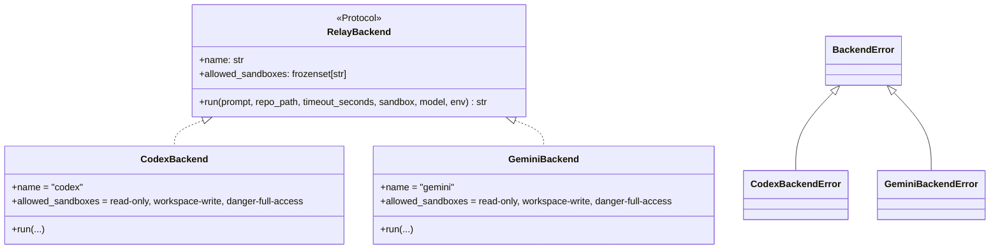
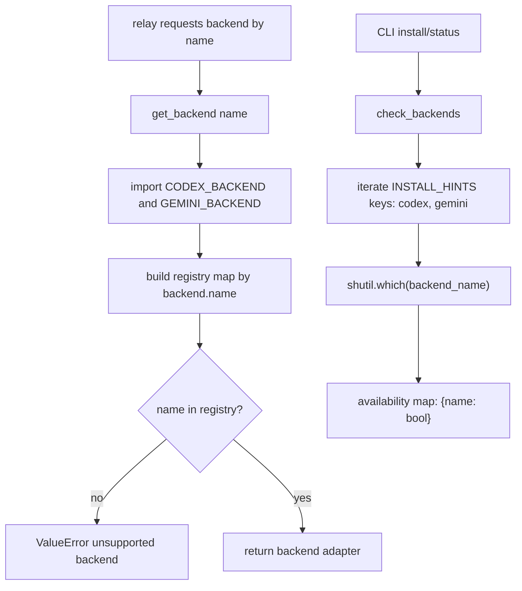
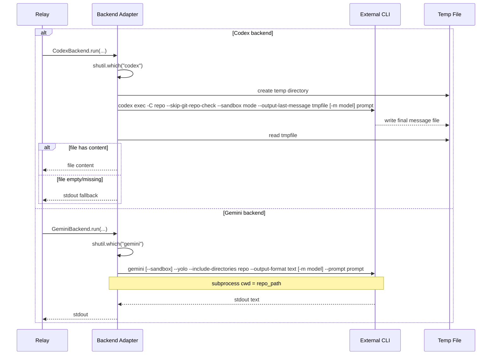

# Backend System

The backend subsystem defines a common execution contract (`RelayBackend`), runtime backend selection (`get_backend`), backend availability probing (`check_backends`), and concrete adapters for Codex and Gemini CLIs with a shared error surface.

## Backend Type Model and Error Hierarchy

## Registry and Discovery Flow

## Backend Invocation Sequences

## Codex vs Gemini: CLI Flag Mapping

| Concept | Codex | Gemini |
|---------|-------|--------|
| Non-interactive mode | `codex exec` | `gemini --prompt` |
| Repo context | `-C <repo>` | `--include-directories <repo>` + `cwd=repo` |
| Sandbox: read-only | `--sandbox read-only` | `--sandbox` (boolean on) |
| Sandbox: workspace-write | `--sandbox workspace-write` | `--sandbox` (boolean on) |
| Sandbox: danger-full-access | `--sandbox danger-full-access` | (omit `--sandbox`) |
| Auto-approve | N/A | `--yolo` |
| Output capture | `--output-last-message <file>` | `--output-format text` (stdout) |
| Model override | `-m <model>` | `-m <model>` |
| Git check skip | `--skip-git-repo-check` | N/A |

## Key Components and Responsibilities

| Component | Role |
|-----------|------|
| `RelayBackend` protocol | Stable adapter contract used by relay core |
| `INSTALL_HINTS` dict | Single source for backend install guidance |
| `get_backend(name)` | Explicit registry lookup and validation |
| `check_backends()` | CLI-level PATH probing for availability |
| `BackendRegistration` dataclass | Backend metadata container (name + backend) |
| `CodexBackend` | Adapter for `codex exec` with temp file output |
| `GeminiBackend` | Adapter for `gemini --prompt` with stdout capture |

## Important Design Decisions

- Registry is explicit and code-local (no dynamic plugin loading for backends).
- Supported backend names are currently fixed to `codex` and `gemini`.
- No built-in multi-backend fallback in relay core; caller decides backend strategy.
- Both adapters share the same allowed sandbox value set for consistent relay validation.
- Error taxonomy is intentionally simple: one base class plus backend-specific subclasses.
- Codex uses temp file as primary output channel with stdout fallback; Gemini captures stdout directly.
