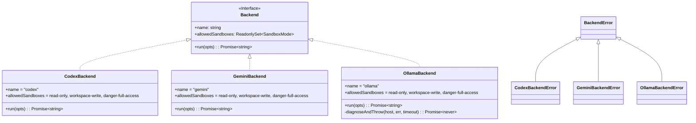
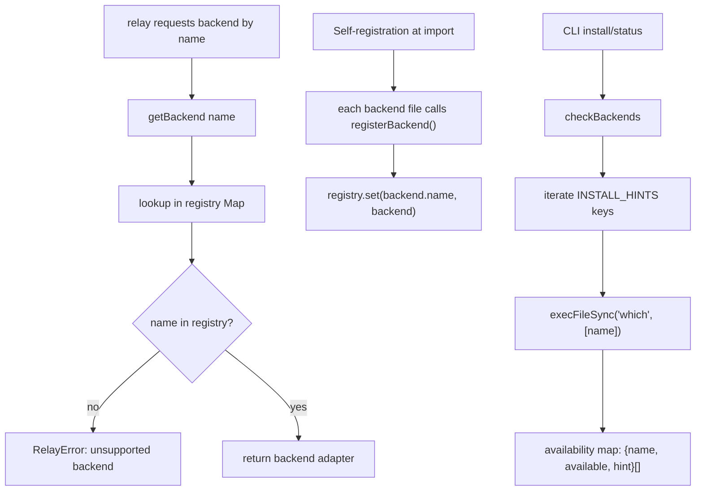
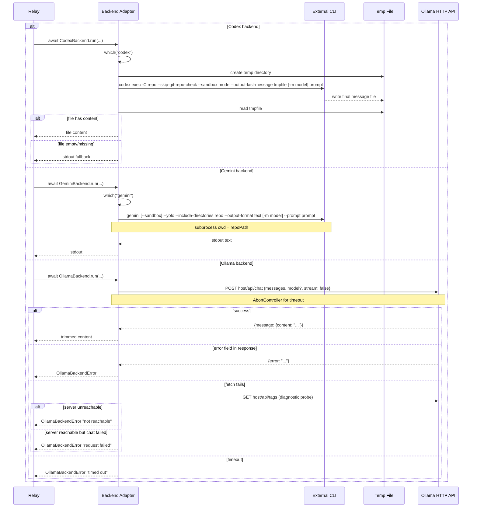

# Backend System

The backend subsystem defines a common async execution contract (`Backend` interface), a runtime registry (`registerBackend`/`getBackend`), backend availability probing (`checkBackends`), and concrete adapters for Codex CLI, Gemini CLI, and Ollama HTTP API, with a shared error surface.

## Backend Type Model and Error Hierarchy

## Registry and Discovery Flow

## Backend Categories

| Category | Backends | Execution Model |
|----------|----------|-----------------|
| CLI subprocess | codex, gemini | `execFileSync` with args, captures stdout or temp file |
| HTTP API | ollama | `fetch` POST to local API, JSON response parsing |

## Backend Invocation Sequences

## Codex vs Gemini vs Ollama: Comparison

| Concept | Codex | Gemini | Ollama |
|---------|-------|--------|--------|
| Execution model | Subprocess | Subprocess | HTTP fetch |
| Non-interactive mode | `codex exec` | `gemini --prompt` | `POST /api/chat` |
| Repo context | `-C <repo>` | `--include-directories <repo>` + `cwd=repo` | N/A (prompt only) |
| Sandbox: read-only | `--sandbox read-only` | `--sandbox` (boolean on) | N/A (pure inference) |
| Sandbox: workspace-write | `--sandbox workspace-write` | `--sandbox` (boolean on) | N/A |
| Sandbox: danger-full-access | `--sandbox danger-full-access` | (omit `--sandbox`) | N/A |
| Auto-approve | N/A | `--yolo` | N/A |
| Output capture | `--output-last-message <file>` | `--output-format text` (stdout) | JSON `message.content` |
| Model override | `-m <model>` | `-m <model>` | `body.model` or `OLLAMA_MODEL` env |
| Model default | CLI default | CLI default | Server default (omit field) |
| Host override | N/A | N/A | `OLLAMA_HOST` env |
| Timeout | `execFileSync` timeout | `execFileSync` timeout | `AbortController` + `setTimeout` |

## Key Components and Responsibilities

| Component | Role |
|-----------|------|
| `Backend` interface | Async adapter contract used by relay core |
| `registerBackend()` | Self-registration called at module import |
| `getBackend(name)` | Registry lookup and validation |
| `INSTALL_HINTS` record | Single source for backend install guidance |
| `checkBackends()` | CLI-level PATH probing for availability |
| `BackendError` base class | Shared error surface for all backends |
| `CodexBackend` | Adapter for `codex exec` with temp file output |
| `GeminiBackend` | Adapter for `gemini --prompt` with stdout capture |
| `OllamaBackend` | HTTP adapter for Ollama `/api/chat` with diagnostics |

## Important Design Decisions

- Registry uses self-registration: each backend file calls `registerBackend()` at import time.
- `src/index.ts` imports all backend files to trigger registration before CLI runs.
- Supported backends: `codex`, `gemini`, `ollama`. No dynamic plugin loading.
- No built-in multi-backend fallback in relay core; caller decides backend strategy.
- All adapters share the same allowed sandbox value set for consistent relay validation.
- Error taxonomy: one base class (`BackendError`) plus backend-specific subclasses.
- Codex uses temp file as primary output channel with stdout fallback; Gemini captures stdout directly; Ollama parses JSON response.
- Ollama uses failure-path diagnostics: only probes `/api/tags` when `/api/chat` fails, to distinguish timeout vs unreachable vs request error.
- All `run()` methods are async (`Promise<string>`) to support both subprocess and HTTP backends uniformly.
