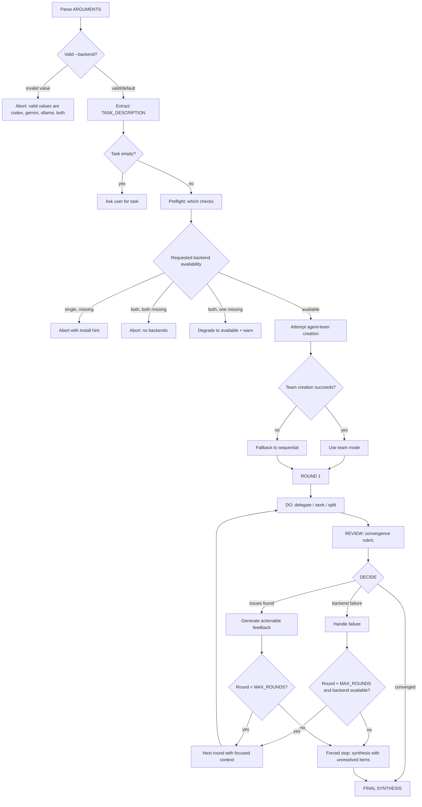
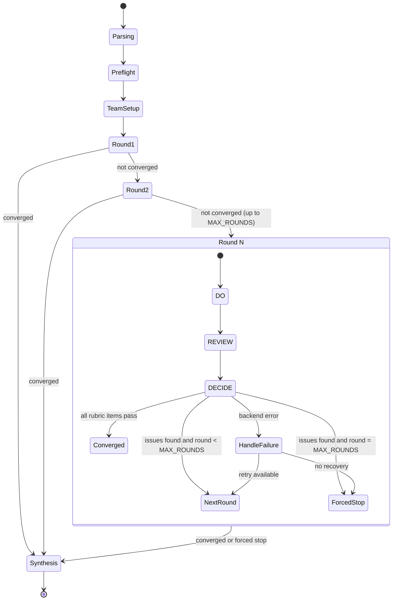
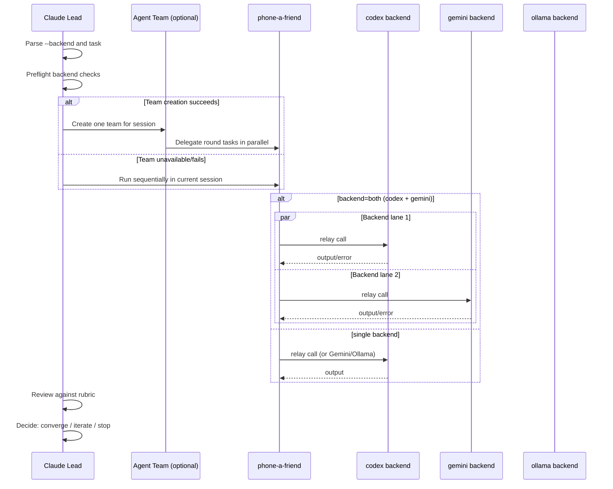
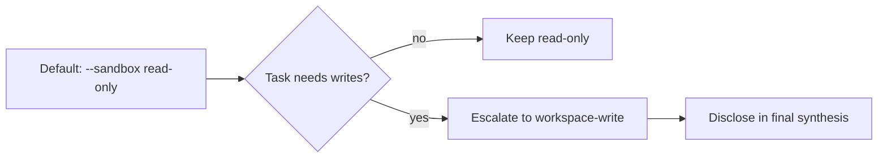

# Phone-a-Team Iterative Loop

`/phone-a-team` is an iterative orchestration layer defined in `commands/phone-a-team.md`. It runs a structured do-review-decide loop (default 3 rounds, configurable 1–5 via `--max-rounds`) over one or more backends via `phone-a-friend`, with optional Claude agent-team acceleration and deterministic fallback behavior.

> **Note:** `/phone-a-team` is a prompt policy, not compiled code. The diagrams below describe the behavior enforced by the slash command prompt file (`commands/phone-a-team.md`), not runtime code paths. There is no loop construct in the TypeScript source — Claude's agent runtime follows the prompt instructions to iterate.

## Loop Architecture

## Round Lifecycle State Diagram

## Team Mode vs Sequential Fallback

## Argument Parsing

| Input | Result |
|-------|--------|
| `--backend codex` | BACKEND = `codex` |
| `--backend gemini` | BACKEND = `gemini` |
| `--backend ollama` | BACKEND = `ollama` |
| `--backend both` | BACKEND = `both` |
| No `--backend` flag | BACKEND = `codex` (default) |
| `--backend invalid` | Error and stop |
| Empty task after parsing | Ask user before proceeding |

## Preflight and Degradation Rules

| BACKEND | codex available | gemini available | Action |
|---------|-----------------|------------------|--------|
| `codex` | yes | -- | Proceed |
| `codex` | no | -- | Abort with install hint |
| `gemini` | -- | yes | Proceed |
| `gemini` | -- | no | Abort with install hint |
| `ollama` | -- | -- | Proceed (HTTP, no binary check) |
| `both` | yes | yes | Proceed with both |
| `both` | yes | no | Degrade to codex + warn |
| `both` | no | yes | Degrade to gemini + warn |
| `both` | no | no | Abort: no backends |

## Convergence Rubric

All three items must pass for convergence:

1. **Acceptance criteria met** -- Does the output accomplish the task as described?
2. **No critical risks or correctness issues** -- Free of bugs, security issues, logical errors, significant omissions?
3. **Validation done** -- Output checked (tests run, code reviewed, logic verified)? If skipped, is there a documented reason?

## Context Budget Management

Each relay call sends only:
- Original task description
- Latest output or delta from previous round
- 2-3 sentence summary of prior rounds (if referencing them)

No full conversation history. No accumulated prior outputs. Rationale: stay within relay caps (200 KB context, 300 KB diff, 500 KB prompt).

## Sandbox Escalation Policy

## Backend Failure Handling Matrix

| Scenario | Action |
|----------|--------|
| Single backend requested and available | Normal loop |
| Single backend requested but missing | Abort with install hint |
| Both requested, one missing at preflight | Degrade to available backend |
| Both requested, one fails mid-loop | Continue with remaining, note failure |
| Both requested, both fail mid-loop | Stop loop; synthesize failure summary |
| Backend returns 429 (rate limited) | Skip for current round, retry next |
| Backend timeout/crash | Treat as round failure; retry next round |

## Important Design Decisions and Constraints

- Default loop cap is 3 rounds, configurable 1–5 via `--max-rounds`.
- Early stop on convergence is required (no unnecessary iterations).
- Feature is prompt policy, not runtime-enforced code.
- No re-entrancy: do not nest `/phone-a-team` within `/phone-a-team`.
- One team per session when team mode is used.
- Teammates use `mode: "bypassPermissions"` to avoid blocking the user with permission prompts.
- `/phone-a-team` treats `phone-a-friend` internals as a black box.
- Token usage is higher than single `/phone-a-friend` (multiple relay calls + review overhead).
