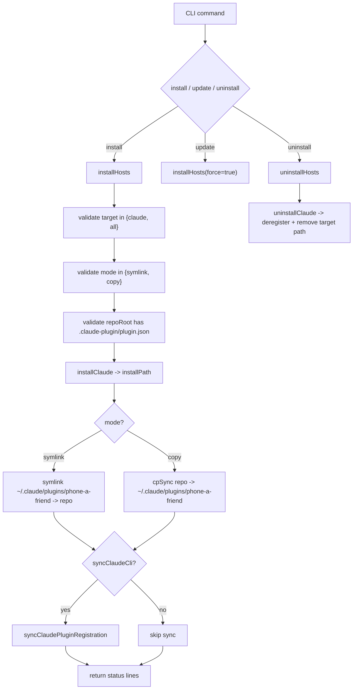
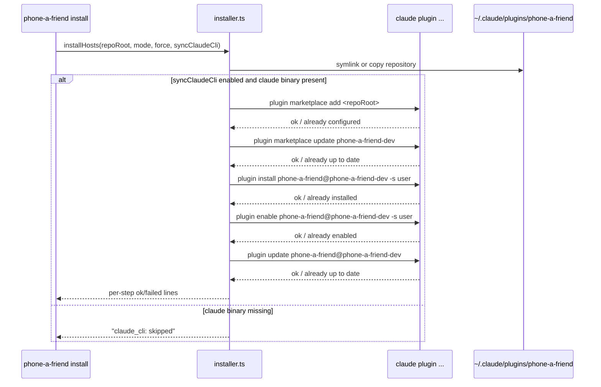
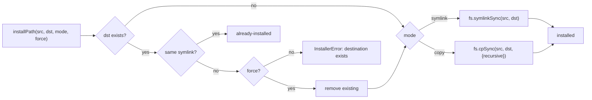
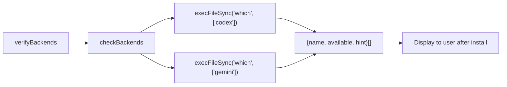

# Installer and Plugin System

The installer subsystem wires this repository into Claude Code's plugin ecosystem and manages lifecycle operations (`install`, `update`, `uninstall`). It also optionally synchronizes plugin registration via the `claude` CLI and reports backend availability status after install.

## Install/Update/Uninstall Lifecycle

## Claude Plugin Registration Flow

## Install Path Resolution

## Plugin Status Detection

`isPluginInstalled()` checks whether the Claude plugin is installed:
- Resolves `claudeTarget()` path (`~/.claude/plugins/phone-a-friend`)
- For symlinks: checks exists + valid target (not dangling)
- For copies: checks directory exists
- Used by TUI's `PluginStatusBar` component for live status display

## Key Components and Responsibilities

| Component | Role |
|-----------|------|
| `installHosts()` | Top-level install orchestrator: validates, installs, syncs |
| `uninstallHosts()` | Top-level uninstall: deregisters from Claude CLI, removes target path |
| `installClaude()` | Resolves target path, delegates to `installPath` |
| `installPath()` | Low-level symlink/copy with force and idempotency handling |
| `syncClaudePluginRegistration()` | Runs 5 `claude plugin` commands for marketplace sync |
| `looksLikeOkIfAlready()` | Idempotency detector for "already installed" responses |
| `verifyBackends()` | Reports backend CLI availability post-install |
| `isValidRepoRoot()` | Validates `.claude-plugin/plugin.json` exists |
| `isPluginInstalled()` | Checks if Claude plugin symlink/copy exists |
| `claudeTarget()` | Resolves `~/.claude/plugins/phone-a-friend` path |

## Symlink vs Copy Modes

| Mode | Use Case | Behavior |
|------|----------|----------|
| `symlink` | Local development | Installed path points to live repo state; changes reflect immediately |
| `copy` | Snapshot install | Full copy into `~/.claude/plugins/`; isolated from ongoing edits |

## Marketplace Integration

The installer runs Claude CLI commands in this fixed sequence:

1. `claude plugin marketplace add <repoRoot>` -- register source
2. `claude plugin marketplace update phone-a-friend-dev` -- refresh index
3. `claude plugin install phone-a-friend@phone-a-friend-dev -s user` -- install package
4. `claude plugin enable phone-a-friend@phone-a-friend-dev -s user` -- activate
5. `claude plugin update phone-a-friend@phone-a-friend-dev` -- pull latest

"Already installed/configured/up to date" responses are treated as successful idempotent completions.

Constants:
- `PLUGIN_NAME = "phone-a-friend"`
- `MARKETPLACE_NAME = "phone-a-friend-dev"`

## Backend Availability Verification

## Important Design Decisions

- Repo-root validity gate requires `.claude-plugin/plugin.json`.
- Install target scope is currently Claude-only (`claude`/`all` aliases).
- Installer is idempotence-aware for "already" states from Claude CLI.
- Backend checks are advisory; installation does not fail due to missing backend CLIs.
- CI/release enforce version sync between `package.json` and `.claude-plugin/plugin.json`.
- Uninstall now deregisters from Claude CLI plugin registry before removing files.
- `isPluginInstalled()` enables TUI to show real-time plugin status.
