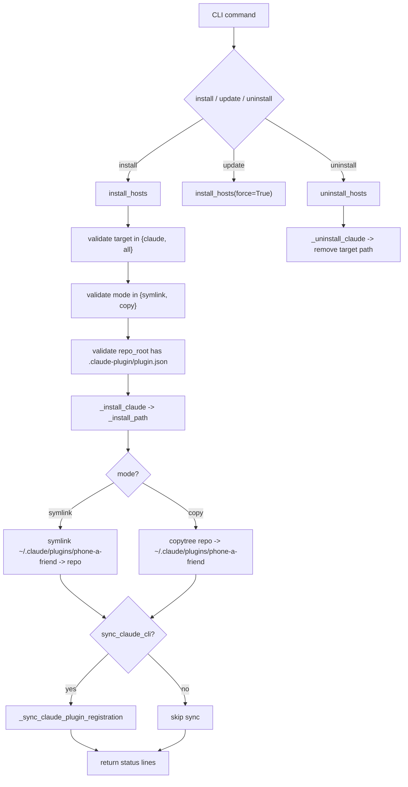
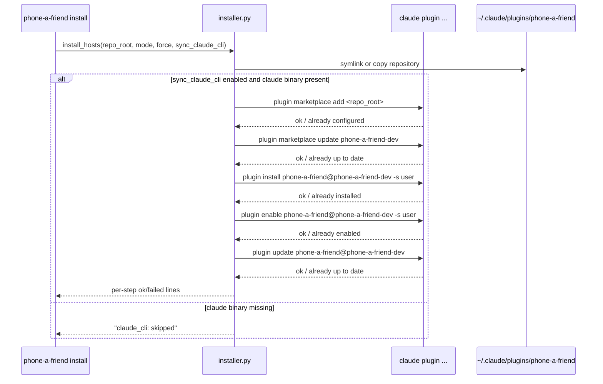
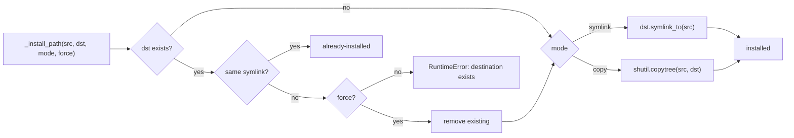
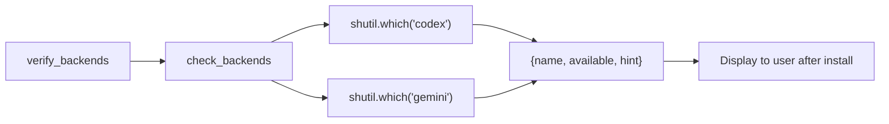

# Installer and Plugin System

The installer subsystem wires this repository into Claude Code's plugin ecosystem and manages lifecycle operations (`install`, `update`, `uninstall`). It also optionally synchronizes plugin registration via the `claude` CLI and reports backend availability status after install.

## Install/Update/Uninstall Lifecycle

## Claude Plugin Registration Flow

## Install Path Resolution

## Key Components and Responsibilities

| Component | Role |
|-----------|------|
| `install_hosts()` | Top-level install orchestrator: validates, installs, syncs |
| `uninstall_hosts()` | Top-level uninstall: removes plugin target path |
| `_install_claude()` | Resolves target path, delegates to `_install_path` |
| `_install_path()` | Low-level symlink/copy with force and idempotency handling |
| `_sync_claude_plugin_registration()` | Runs 5 `claude plugin` commands for marketplace sync |
| `_looks_like_ok_if_already()` | Idempotency detector for "already installed" responses |
| `verify_backends()` | Reports backend CLI availability post-install |
| `_is_valid_repo_root()` | Validates `.claude-plugin/plugin.json` exists |

## Symlink vs Copy Modes

| Mode | Use Case | Behavior |
|------|----------|----------|
| `symlink` | Local development | Installed path points to live repo state; changes reflect immediately |
| `copy` | Snapshot install | Full copy into `~/.claude/plugins/`; isolated from ongoing edits |

## Marketplace Integration

The installer runs Claude CLI commands in this fixed sequence:

1. `claude plugin marketplace add <repo_root>` -- register source
2. `claude plugin marketplace update phone-a-friend-dev` -- refresh index
3. `claude plugin install phone-a-friend@phone-a-friend-dev -s user` -- install package
4. `claude plugin enable phone-a-friend@phone-a-friend-dev -s user` -- activate
5. `claude plugin update phone-a-friend@phone-a-friend-dev` -- pull latest

"Already installed/configured/up to date" responses are treated as successful idempotent completions.

Constants:
- `PLUGIN_NAME = "phone-a-friend"`
- `MARKETPLACE_NAME = "phone-a-friend-dev"`

## Backend Availability Verification

## Important Design Decisions

- Repo-root validity gate requires `.claude-plugin/plugin.json`.
- Install target scope is currently Claude-only (`claude`/`all` aliases).
- Installer is idempotence-aware for "already" states from Claude CLI.
- Backend checks are advisory; installation does not fail due to missing backend CLIs.
- CI/release enforce version sync between `pyproject.toml` and `.claude-plugin/plugin.json`.
